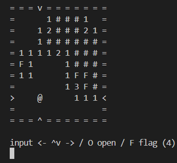

# mine_sweeper_rb



## About this code

This code is my Ruby programming practice.

## Dependency

- [tty-reader](https://github.com/piotrmurach/tty-reader)

## CLI game

```bash
ruby MineSweeper.rb
```
